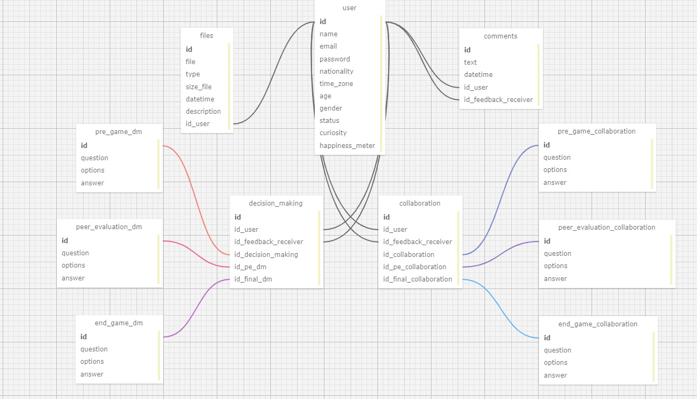

# Ponderada - Modelagem de banco de dados

A modelagem de banco de dados é importante por vários fatores, como organização dos dados, flexibilicação, normalização, integridade dos dados, entre outros pontos muito importantes.  Isso acontece porque a estruturação correta de diferentes tabelas ajuda na organização, além disso, essa estruturação permite fáceis modificações e adaptações das estruturas dos dados. Também, é promovida uma normalização dos dados, importante para evitar redundâncias e repetições. Por fim, a integridade dos dados garante precisão e consistência nos dados armazenados.   

Em nosso projeto para a parceira Zuyd, foi pedido que realizássemos uma aplicação web que seria uma plataforma onde os participantes da simulação internacional de negócios teriam a oportunidade de realizar as avaliações de collaboration e decision-making, nas fases antes, durante e após o fim do jogo. Além disso, a proposta também é de uma integração cultural, por isso que há espaço para muitos dados dos usuários serem coletados, para que possam ser exibidos, alguns deles, para que a comunicação dos participantes ser facilitada. Por fim, haverá espaços de upload e download de arquivos a opções de adição de comentários. 

 

